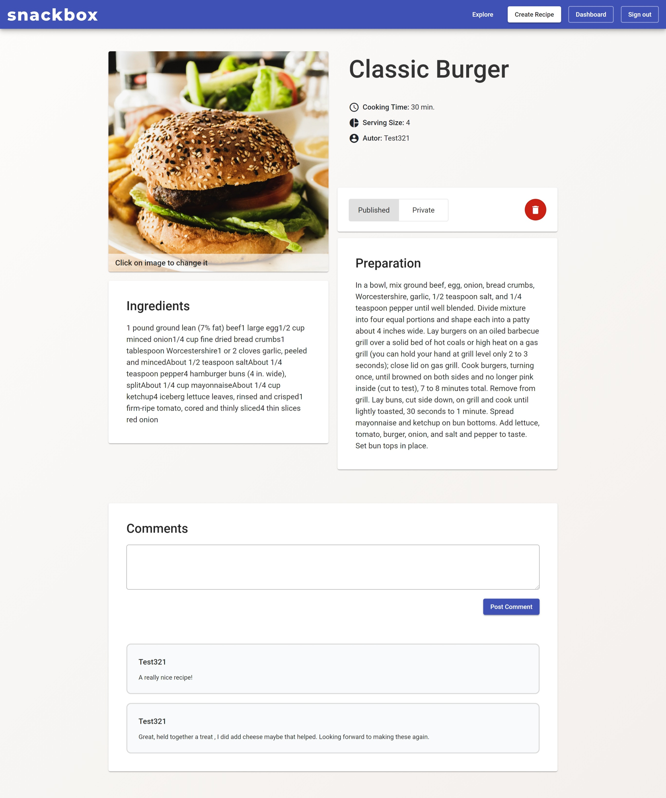

# Snackbox

Snackbox is a web application to store and share recipes. This project was a school project where the focus was mainly on security. The frontend was made with Angular and the api with Express (NodeJS).

 

## Features

* You can register with your cell phone number and when you log in, an SMS token is sent via an API
* If you have registered with your phone number, you can change it on the dashboard page
* You can sign up and log in with your Google account
* On the dashboard page you can see all your recipes
* On the explore page you can see all public recipes
* You can create new recipes and change your own ones
* You can comment below recipes
* You can make an existing user an admin user by setting `isAdmin`  to `1` in the database
* As admin you can see and edit every recipe (even deleted ones)

 

## Setup

1. Run the `db/init.sql` script in your local oder live MySQL environment
2. Specify the database properties in the `api/models/queries.js` file
3. Modify the function `sendSMSToken` in `api/models/authenticate.js` if you want to enable the SMS token function
4. Add your Google User Content Key in `frontend/src/app/app.modules.ts` if you want to enable the *Sign in with Google* function
5. Go into the folder `/api` and run `npm install`
6. Start the API with `npm start`
7. Go into the folder `/frontend` and run `npm install`
8. Start the frontend with `npm start`
9. Go to `http://localhost:4200/`

 

## Libraries used

* **Express**
* **Helmet**
  * Helmet helps with the security of the API. It protects against:
    * Clickjacking attacks by setting the X-Frame options on request headers
      * Framebusting is used to protect the frontend from clickjacking attacks. But actually this should be done by HTTP headers at the server
        * for Apache: "headers always append X-Frame-Options SAMEORIGIN"
        * for nginx: "add_header X-Frame-Options SAMEORIGIN"
    * XSS attacks through content security policy
    * XSS attacks through an XSSFilter
    * Sniffing
* **Morgan**
  * Morgan logs out all HTTP requests in the console
  * Additionally, all HTTP requests are logged in the requests.log file in the /log directory
* **Log4js**
  * Log4js is used to log out errors and warnings to the snackbox.log file
    * All API requests are logged with username, API endpoint and status, so you can see where the most errors happen
    * A DDOS attack or overfilling of the DB with post requests can be prevented
      * Logfile: `/logs/requests.log`
    * Errors that occur in the code are also logged for optimization and bugfixing
      * Logfile: `/logs/snackbox.log`

 

### Recipe page screenshot

